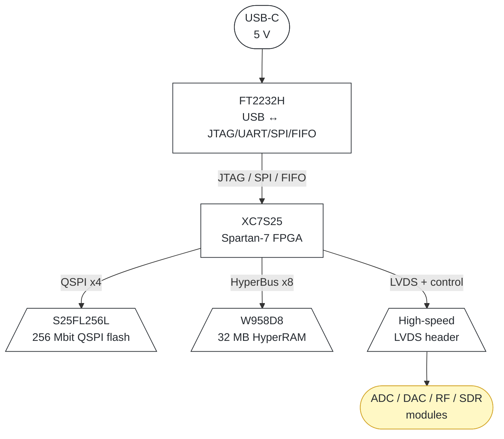

  <h1 align="center">Lyrion FPGA-25</h1>
  

    <strong>Spartan-7 FPGA Platform for DSP, SDR & High-Speed Digital Work</strong> 
    XC7S25 with 32 MB HyperRAM, 256 Mbit QSPI flash, FT2232H USB/JTAG, and an LVDS expansion header
  

  
  
  
  
  

---

## Table of Contents

1. [What is it?](#what-is-it)
2. [Key Features](#key-features)
3. [System Overview](#system-overview)
4. [Core Hardware](#core-hardware)
   1. [FPGA](#fpga)
   2. [Memory](#memory)
   3. [USB and Debug](#usb-and-debug)
   4. [Expansion](#expansion)
   5. [Power System](#power-system)
5. [Ecosystem Positioning](#ecosystem-positioning)
6. [Design Decisions](#design-decisions)
7. [Status & Roadmap](#status--roadmap)
8. [Known Limitations & Open Questions](#known-limitations--open-questions)
9. [License](#license)

---

## What is it?

Lyrion FPGA-25 is a **compact, general-purpose FPGA development board** built around the **AMD/Xilinx Spartan-7 XC7S25**. It is the first reusable FPGA platform in the Lyrion ecosystem, and it acts as the shared base for everything that is too fast, too parallel, or too timing-sensitive for an STM32, while staying small and cheap enough to build, break, and learn on.

It is **not** the final radar board, and it is **not** a heavy-compute platform. It is the deterministic hardware-acceleration layer that sits between simple MCU nodes and the later Artix and RK3566-class boards.

Target work covers FPGA bring-up and timing closure, FFT and DSP pipeline experiments, SDR baseband work, high-speed digital interface bring-up (LVDS ADC/DAC and parallel buses), ADC and DAC module testing, and future Lyrion accelerator boards.

---

## Key Features

| Feature | Specification |
|---------|---------------|
| **FPGA** | AMD/Xilinx Spartan-7 XC7S25 (`XC7S25-2CSGA225C`, fallback `XC7S25-1CSGA225C`) |
| **Logic** | ~14,700 LUTs and ~29,400 flip-flops (about 23,300 logic cells) |
| **DSP** | 90 DSP48E1 slices |
| **Block RAM** | ~90 Kb internal |
| **Config flash** | S25FL256L, 256 Mbit (32 MB) Quad-SPI, WSON-8 |
| **Runtime memory** | Winbond W958D8, 256 Mbit (32 MB) HyperRAM, x8, 1.8 V, 200 MHz class |
| **USB / debug** | FTDI FT2232H for JTAG, UART, SPI, and FIFO streaming (no external programmer) |
| **Expansion** | High-speed header with LVDS data/clock pairs, SPI, I²C, UART, GPIO, and power |
| **Power** | Richtek RT7273 buck plus post-LDO clean rails |
| **Input** | USB-C (5 V) |
| **Target cost** | roughly €75 to €90 per board (small JLCPCB assembly run) |

> The **resource figures** (LUTs, FF, DSP, BRAM) are the commonly published XC7S25 values. **UNVERIFIED**: confirm the exact numbers against the Spartan-7 datasheet (DS890) before finalising the design.

---

## System Overview

### Block summary

| Block | Function | Key parts |
|-------|----------|-----------|
| **FPGA** | Programmable logic, DSP, interfaces, optional soft CPU | XC7S25 Spartan-7 |
| **Configuration** | Bitstream storage, alternate images, calibration and persistent data | S25FL256L 256 Mbit QSPI flash |
| **Runtime memory** | FFT buffers, IQ sample buffering, DSP scratch, frame storage | W958D8 256 Mbit HyperRAM |
| **USB / debug** | JTAG programming and ILA debug, UART console, SPI control, FIFO streaming | FT2232H |
| **Expansion** | LVDS plus control and power to future modules | High-speed header |
| **Power** | Efficient bulk conversion plus low-noise analog rails | RT7273 buck and LDOs |

### Data and control flow

1. **USB-C** powers the board and carries the USB 2.0 link to the **FT2232H**.
2. The **FT2232H** exposes the FPGA over **JTAG** (programming and debug), **UART** (console), **SPI** (control), and optionally a **245-FIFO** stream to the PC.
3. The **XC7S25** boots its bitstream from **QSPI flash** in master SPI mode.
4. Running designs use **HyperRAM** over HyperBus for large buffers such as FFT, IQ, and frames.
5. The **high-speed header** breaks out LVDS data and clock pairs plus SPI, I²C, UART, GPIO, and power to ADC, DAC, RF, and SDR modules.

---

## Core Hardware

### FPGA

The **AMD/Xilinx Spartan-7 XC7S25**, ordered as `XC7S25-2CSGA225C`, is the main programmable logic device. It serves as the DSP and interface engine, an optional soft-CPU host, and the high-speed data handler.

| Parameter | Value |
|-----------|-------|
| Logic cells | ~23,300 |
| LUTs and flip-flops | ~14,700 and ~29,400 |
| DSP48E1 slices | 90 |
| Block RAM | ~90 Kb |
| Configuration | QSPI (x1/x2/x4), Master SPI |
| High-speed serial transceivers | **None** (Spartan-7 has no GTP/GTH) |
| SelectIO | LVDS_25, OSERDES/ISERDES, ~1.25 Gbps class |

**Why this device:** it costs far less than larger Artix parts, has enough logic and DSP for real FFT and filtering work, has enough BRAM for internal buffering, and is a good learning target before moving to bigger boards.

> **Critical architectural fact:** Spartan-7 has **no hard high-speed serial transceivers**. There is no native PCIe, USB3, GigE, SFP, or JESD204. Those need an external PHY over SelectIO, or a larger Artix or Kintex. High-speed work on this board means **parallel LVDS**, not multi-gigabit serial. This is by design and matches the scope of the board.

> **Ordering code (decided):** primary part **`XC7S25-2CSGA225C`** — Spartan-7 XC7S25, speed grade -2, commercial temperature (0 to +85 °C junction), CSGA225 225-ball package (13×13 mm, 0.8 mm pitch). **Out-of-stock fallback:** **`XC7S25-1CSGA225C`** — identical package, footprint, and configuration, with the lower -1 speed grade. The fallback only counts as an identical replacement once timing closure is demonstrated at the -1 grade; high-speed LVDS interfaces (OSERDES/ISERDES) are the first place the speed-grade difference shows up. **UNVERIFIED**: confirm the exact user-I/O count for the CSGA225 package against DS890. A 0.8 mm BGA is not a friendly hand-solder target.

### Memory

#### Configuration flash: S25FL256L

| Parameter | Value |
|-----------|-------|
| Density | 256 Mbit (32 MB) |
| Interface | Quad-SPI (QSPI) |
| Package | WSON-8 |
| Supply | 3.0 V (S25FL256L family) |

Planned use: boot configuration, alternate FPGA images, calibration tables, and small persistent settings.

> **UNVERIFIED**: the exact ordering code (`S25FL256LPNFM010`) and the 3.0 V supply must be confirmed against the datasheet. If the flash is 3.0 V, then the FPGA configuration bank (and the flash VCC) must run at 3.3 V, so plan the power tree and bank voltage accordingly.

#### Runtime memory: Winbond W958D8 HyperRAM

| Parameter | Value |
|-----------|-------|
| Density | 256 Mbit (32 MB usable) |
| Interface | HyperBus, x8 |
| Supply | 1.8 V |
| Clock | 200 MHz class (DDR) |
| Peak bandwidth | ~400 MB/s (200 MHz × 2 × 8 bit) |

Planned use: FFT buffers, IQ sample buffering, DSP scratch, frame storage, and soft-CPU memory expansion.

> **HyperRAM is not low-latency random-access SRAM.** It is a burst-oriented, register-file memory with an initial access latency of several clocks before each burst. It is **excellent** for sequential and burst workloads such as FFT ping-pong buffers, contiguous IQ capture, and frame storage, and it is **poor** for scattered small random accesses. Sustained throughput, once latency and refresh overhead are included, is realistically about 200 to 300 MB/s rather than the 400 MB/s peak.
>
> Spartan-7 has **no hard HyperBus controller**, so the interface must be implemented in fabric, either as soft IP or a custom FSM. **UNVERIFIED**: confirm the W958D8 max clock for the specific grade from the Winbond datasheet.

### USB and Debug

The **FTDI FT2232H** is a dual-channel USB 2.0 Hi-Speed (480 Mbps) bridge.

| Channel use | Mode |
|-------------|------|
| JTAG programming and ILA debug | MPSSE (supported by Vivado hw_server and openocd) |
| UART console | UART |
| SPI control | MPSSE SPI |
| PC streaming (optional) | 245 synchronous FIFO |

This means the board needs **no external programmer** for normal development.

> **Throughput reality check.** Practical 245-FIFO throughput is on the order of **8 to 12 MB/s per channel**, with the two channels sharing one USB 2.0 Hi-Speed link (about 35 to 40 MB/s aggregate in the best case). That is ample for JTAG, console, control, and modest IQ or spectrum streaming. It is **not** a path for sustained multi-hundred-MB/s raw capture. For reference, a 250 MSPS, 14-bit, two-channel radar stream is about 700 MB/s, and that workload does not belong on this board, which is consistent with the stated scope.

### Expansion

A high-speed connector turns the board into a **platform** rather than a one-off dev board.

| Signal class | Examples |
|--------------|----------|
| High-speed data | LVDS data pairs, LVDS clock pairs |
| Control | SPI, I²C, UART, GPIO |
| Power | Module rails (filtered) |

Use cases: ADC modules, DAC modules, SDR/IQ modules, camera or sensor interfaces, and custom Lyrion modules.

> **Signal-integrity note.** LVDS interfaces such as an AD9643-class ADC at 250 MSPS DDR are feasible on Spartan-7 SelectIO using ISERDES/OSERDES, but timing closure at the slowest speed grade needs care, controlled-impedance routing, and a **proper high-density connector** (not a 2.54 mm pin header) to preserve the differential pairs. Connector and pinout selection is an open task.

### Power System

| Stage | Part | Role |
|-------|------|------|
| Bulk conversion | Richtek RT7273 | Efficient synchronous step-down from USB-C 5 V |
| Clean rails | LDOs (TBD) | Low-noise post-regulation for analog-sensitive rails |
| Module rails | Filtered | Future ADC/DAC/RF module supplies |

The Spartan-7 rail set to provide is **VCCINT 1.0 V**, **VCCBRAM 1.0 V**, **VCCAUX 1.8 V**, **VCCADC 1.8 V**, and **VCCO** bank rails at 1.8, 2.5, or 3.3 V as required by the chosen I/O standards (HyperRAM 1.8 V, QSPI flash 3.0/3.3 V, FT2232H 3.3 V).

> **Power sequencing is a first-class design task.** Spartan-7 has explicit ramp and sequencing recommendations in DS890. The RT7273 and LDO enable ordering must respect them, or the device can latch up or fail to configure. **UNVERIFIED**: confirm the exact RT7273 specs (current rating, input range, switching frequency, package) from the Richtek datasheet.

---

## Ecosystem Positioning

The FPGA-25 is the **middle layer** between simple MCU nodes and heavy compute boards.

| Platform | Role | Typical work |
|----------|------|--------------|
| **STM32 boards** | Control, sensing, comms, low-power nodes | CC1101 and LR2021 radio devices, general control |
| **FPGA-25 (this board)** | Deterministic hardware acceleration | DSP, FFT, SDR baseband, high-speed interfaces |
| **Later Artix / RK3566 boards** | Heavy compute | Serious radar and SDR, Linux networking, camera processing |

---

## Design Decisions

### 1. Spartan-7 XC7S25 (not Artix-7)

Artix-7, which is used on the Lyrion Radar, brings more logic, more DSP, more BRAM, and, critically, hard GTP transceivers. That is overkill and over-cost for a learning and experiment platform. The XC7S25 is cheap, has enough resources for real FFT, filtering, and interface work, and is the right size to bring up and master before committing to larger and more expensive boards. The trade-off of fewer resources and no transceivers is deliberate and matches the scope.

### 2. HyperRAM (not DDR3) for runtime memory

DDR3 gives higher sustained bandwidth and true random access, but it demands a hard memory controller (MIG), more pins, tighter routing, and more power. HyperRAM uses a compact x8 HyperBus, far fewer pins, and is trivial to route relative to DDR. For the target workloads of sequential FFT buffers, contiguous IQ capture, and frame storage, burst-oriented HyperRAM is a good fit and keeps the board small and buildable. The cost is latency and the absence of a hard controller, which is implemented in fabric instead.

### 3. FT2232H for USB/JTAG (no external programmer)

A single FT2232H provides JTAG (Vivado or openocd), a UART console, SPI control, and optional FIFO streaming over one USB-C cable. This removes the need for a separate programmer and makes the board self-contained for daily development. The accepted limitation is USB 2.0 Hi-Speed throughput, which is fine for debug and modest streaming but not for raw high-rate capture.

### 4. QSPI flash for configuration and storage

A 256 Mbit QSPI flash holds the boot bitstream plus room for alternate images, calibration tables, and persistent settings. QSPI is natively supported for Spartan-7 master configuration, and 32 MB is generous for this class of device.

### 5. Switching buck plus LDO clean rails

The RT7273 buck does efficient bulk conversion from USB-C 5 V, and LDOs clean up the analog-sensitive rails afterward. This is the standard cost, efficiency, and noise compromise: switching for efficiency and heat, and LDOs where noise matters, including the future ADC/DAC/RF module rails.

### 6. High-speed LVDS expansion header

Breaking out LVDS data and clock pairs plus control and power makes the board a reusable platform for future Lyrion modules (ADC, DAC, SDR/IQ, sensors) instead of a single-purpose dev board. This is the feature that gives the board a life beyond its first bring-up.

---

## Status & Roadmap

| Phase | Status |
|-------|--------|
| Architecture definition | ✅ Done |
| Core component selection | ✅ Done |
| Package and speed-grade selection | ✅ Done (XC7S25-2CSGA225C; fallback XC7S25-1CSGA225C) |
| Power tree and sequencing design | ⬜ Pending |
| Schematic capture | ⬜ Pending |
| PCB layout (controlled-Z LVDS, BGA fanout) | ⬜ Pending |
| Prototype fabrication and assembly | ⬜ Pending |
| Bring-up: power sequencing and JTAG | ⬜ Pending |
| QSPI config and flash verify | ⬜ Pending |
| HyperRAM controller and bandwidth test | ⬜ Pending |
| FT2232H FIFO, UART, and SPI verify | ⬜ Pending |
| LVDS expansion loopback test | ⬜ Pending |
| First DSP/FFT demo design | ⬜ Pending |

---

## Known Limitations & Open Questions

| Issue | Status |
|-------|--------|
| **No high-speed serial transceivers** | Spartan-7 has no GTP/GTH and no native PCIe/USB3/GigE/SFP/JESD204, so it is parallel LVDS only. By design. |
| **XC7S25 resource figures** | LUT, FF, DSP, and BRAM values are commonly published numbers, so **confirm against DS890** before finalising. |
| **Speed-grade fallback verification** | Primary XC7S25-2CSGA225C; fallback XC7S25-1CSGA225C is pin- and bitstream-compatible, but timing closure must be verified at the -1 grade before it is treated as identical. A 0.8 mm BGA (CSGA225) is compact but hard to hand-assemble. |
| **HyperRAM is not random-access SRAM** | Burst-oriented with initial latency; implement the HyperBus controller in fabric; sustained throughput is realistically about 200 to 300 MB/s. |
| **W958D8 max clock** | 200 MHz class assumed, so **confirm the grade from the Winbond datasheet.** |
| **S25FL256L supply and ordering code** | 3.0 V family assumed; the exact ordering code and config-bank voltage **must be confirmed.** |
| **FT2232H throughput ceiling** | USB 2.0 HS limits sustained streaming to tens of MB/s; not for raw high-rate capture. |
| **RT7273 specs** | Current rating, input range, frequency, and package are **TBD from the Richtek datasheet.** |
| **Power sequencing** | Spartan-7 ramp and sequence rules (DS890) must be met by the RT7273 and LDO enable ordering. |
| **LVDS timing closure at the slowest speed grade** | High-speed ADC interfaces need careful constraints, controlled-Z routing, and a proper connector. |
| **Cost estimate** | About €75 to €90 per board is a rough target for a small JLCPCB run, so **verify** against real BOM and assembly quotes. |

---

## License

MIT License. See [LICENSE](LICENSE) for details.
